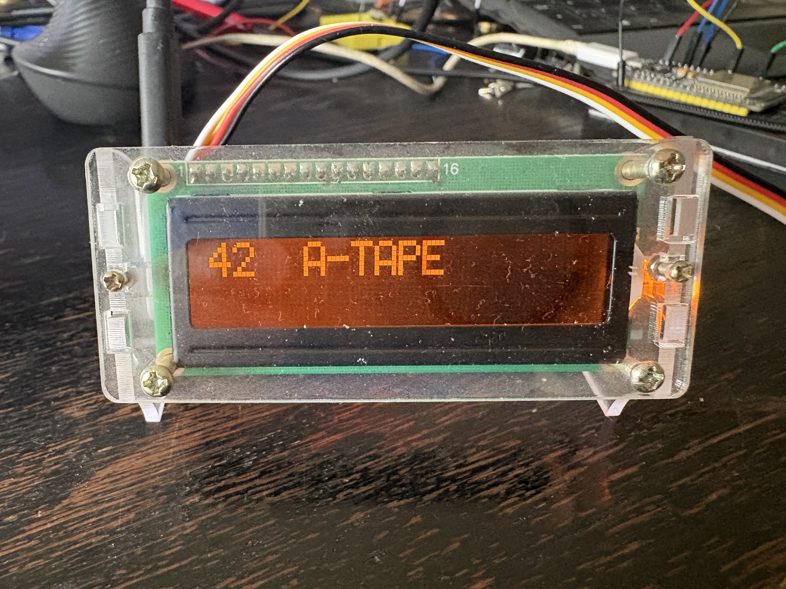
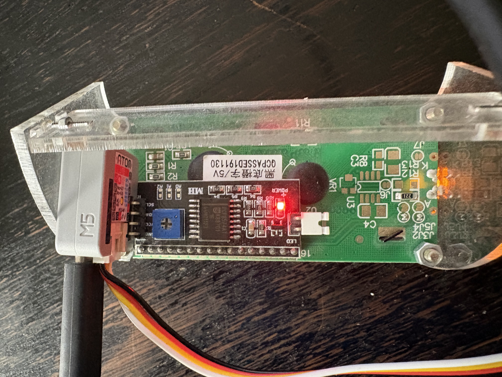
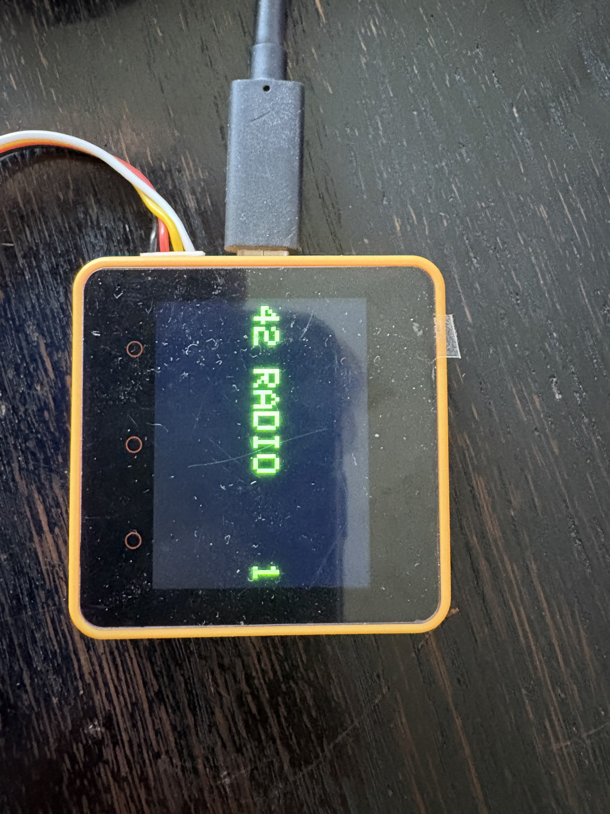

# BeoPowerlinkDisplay

A little standalone display that listens quietly on a Bang & Olufsen **Beolink/MCL "Datalink" bus** and shows what's currently happening — which source is playing, at what volume, whether a tape or CD is cueing forward/backward or paused. It doesn't send anything onto the bus, doesn't need to be paired or configured — plug it in and it just shows what it hears.

<p align="center">
  
</p>

The display style is deliberately kept close to how a real BeoLab Penta or BeoLab 300/5000 shows text on their own small displays — same kind of terse, amber-on-black readout.

## Why

In a Beolink multiroom setup, several rooms share one bus and one Master unit. It's often not obvious from the outside what the bus is actually carrying at any moment — which room asked for what, whether a command actually landed, what the current volume or transport state is. This project is a passive "second pair of eyes" on that traffic: no wiring changes, no interaction with the real equipment, just a live readout of whatever passes by.

## What you'll see on the display

- **Source + volume**, e.g. `12  RADIO`
- **Source + track/channel number**, e.g. `42  A-TAPE`
- **`>>` / `<<`** while a tape or CD is cueing forward or backward
- **`<>`** while paused mid-cue
- **`BASS`**, **`TREBLE`**, **`LAUDN`** and their current setting, when adjusted from the Sound setup menu

## Hardware

Runs on either an [M5Stack Atom](https://docs.m5stack.com/en/core/atom) with a small character LCD attached over I2C, or an [M5Stack Core2](https://docs.m5stack.com/en/core/core2) using its own built-in color screen. Both only need to be connected to the bus's data line and ground — same tap point as any other Beolink device.

<p align="center">
  
  
</p>

## Status

- Verified against a real Master (Beocenter 2300): source selection, volume, Bass/Treble, Loudness, and cueing (`>>`/`<<`/`<>`) all display correctly, confirmed on Radio, CD, and A.Tape.
- Loudness's ON/OFF labeling is still a best guess — the two states are correctly told apart, just not 100% certain which text belongs to which.
- Also usable as a second, independent reader when working on other Beolink-bus projects — it caught real signal-timing issues elsewhere in this project family early on, simply by failing to decode traffic that had a real bug.

## Building

Requires [PlatformIO](https://platformio.org/).

```bash
pio run -e m5stack-atom              # or m5stack-core2 - build
pio run -e m5stack-atom -t upload    # flash
pio device monitor                   # serial log (115200 baud)
```

## Related

- [`Beolab3500-Standalone`](https://github.com/wolfgangschneider/Beolab3500-Standalone) — the sibling project this one shares its bus-reading code with; it emulates a Master unit so a Beolab 3500 can activate a source on its own.

## License

Not yet decided.
